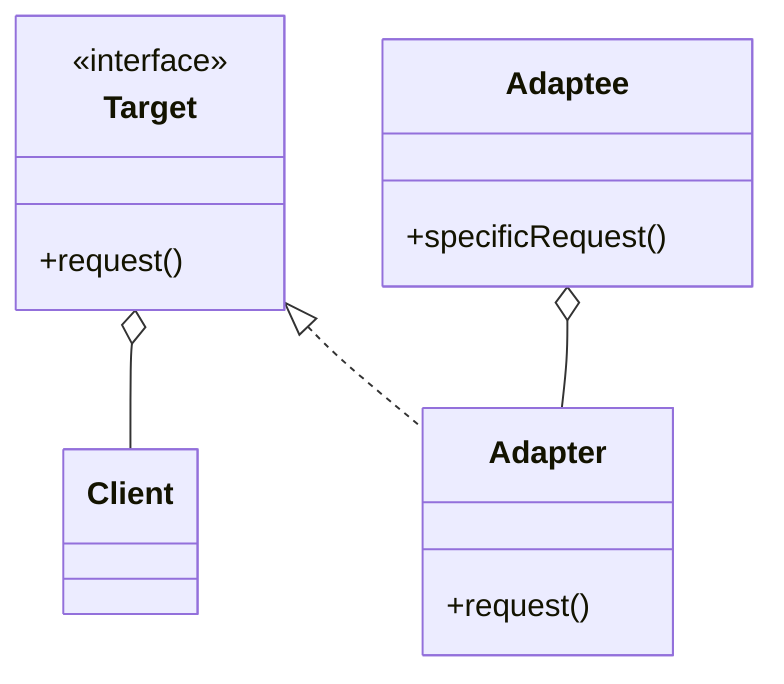

# Adapter Pattern

> Converts the interface of a class into another interface clients expect. Adapter lets classes work together that couldn't otherwise because of incompatible interfaces.

## Rationale

- Allows two systems to interact with one another without needing to modify either system.
- Both systems keep running with their original implementation without knowing they are communicating through the Adapter.
- Although using polymorphism would be ideal, it may not always be possible when working with older systems that are too complex to modify.
- Good for making some vendor system work with another system.

## Example

The **Client** will make a request to the **Adapter** that is part of the **Target** interface. The Adapter will translate the request to an equivalent call on the **Adaptee**, or in some cases multiple calls depending on the complexity of the request. The result will then be returned to the **Client** through the Adapter.

### Code

Say for instance you have already implemented a test method that tests a classes ability to perform an action and it expects a method with the name of `performAction`.
It may be too difficult to modify the existing codebase to accommodate the new requirements. So you may see something like this:

```java
// --- Bar.java (adaptee) ---
public class Bar {
  public void doBarAction() {
    System.out.println("bar");
  }
}

// --- BarAdapter.java ---
public class BarAdapter implements Foo {
  Bar bar;

  public BarAdapter(Bar bar) {
    this.bar = bar;
  }

  public void performAction() {
    bar.doBarAction();
  }
}

// --- Tester.java (client) ---
public class Tester {
  public static void main(String[] args) {
    // test a foo
    Foo foo = new SomeFoo();
    testFoo(foo);

    // test a bar
    Bar bar = new Bar();
    Foo BarAdapter = new BarAdapter(bar);
    testFoo(BarAdapter);
  }

  // tester method that expects a Foo behavior
  public static void testFoo(Foo foo) {
    foo.performAction();
  }
}
```

Essentially whats happening here is we are treating a the **BarAdapter** as if it was a Foo object which in turn is treating Bar as a Foo object.

### Class Diagram


