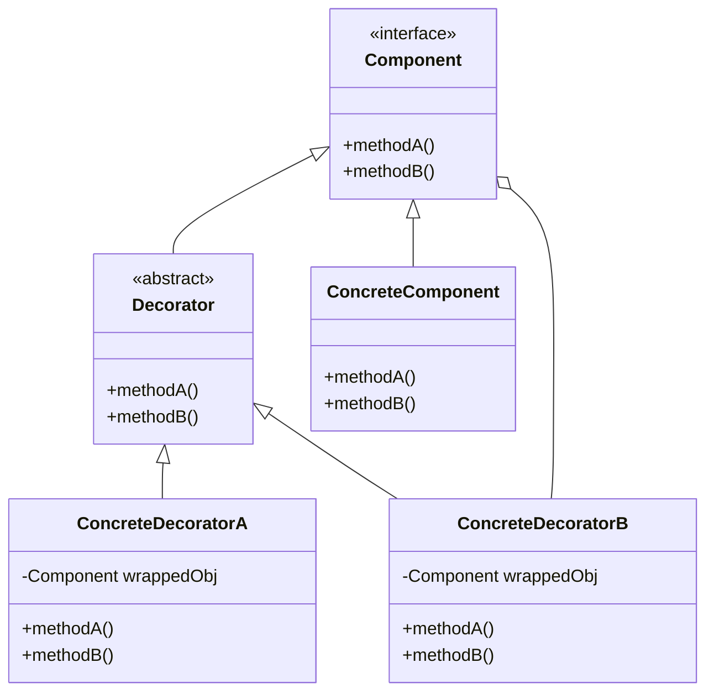

# Decorator Pattern

> Attaches additional responsibilities to an object dynamically. Decorators provide a flexible alternative to sub-classing for extending functionality.

## Rationale

- Classes should be open for extension but closed for modification. This allows for flexible and maintainable code without the risk of breaking existing code.
- The concrete component and the decorator should have the same interface so we can treat them interchangeably. Allowing us to wrap any decorator around any component.

## Example

Say for instance our _**component** is a beverage_, our _**concrete component** is a coffee_, and our _**decorator** is a condiment_. When we want to add a condiment to a beverage, we can create a new decorator that wraps the beverage to effectively add the condiment.

### Code

```java
// --- Beverage.java (Component) ---
public abstract class Beverage {
    String description = "Unknown Beverage";

    public String getDescription() {
        return description;
    }

    public abstract double cost();
}

// --- Coffee.java (Concrete Component) ---
public class Coffee extends Beverage {
    public Coffee() {
        description = "Coffee";
    }

    public double cost() {
        return 1.99;
    }
}

// --- CondimentDecorator.java (Decorator) ---
public abstract class CondimentDecorator extends Beverage {
  public abstract String getDescription();
}

// --- Milk.java (Concrete Decorator) ---
public class Milk extends CondimentDecorator {
  Beverage beverage;

  public Milk(Beverage beverage) {
    this.beverage = beverage;
  }

  public String getDescription() {
    return beverage.getDescription() + ", Milk";
  }

  public double cost() {
    return beverage.cost() + 0.10;
  }
}

// --- Cafe.java (Application)
public class Cafe {
  public static void main(String[] args) {
    // create the beverage
    Beverage beverage = new Coffee();
    // decorate the beverage with 2 milk
    beverage = new Milk(beverage);
    beverage = new Milk(beverage);
    System.out.println(beverage.getDescription() + " $" + beverage.cost());
  }
}
```

### Class Diagram


