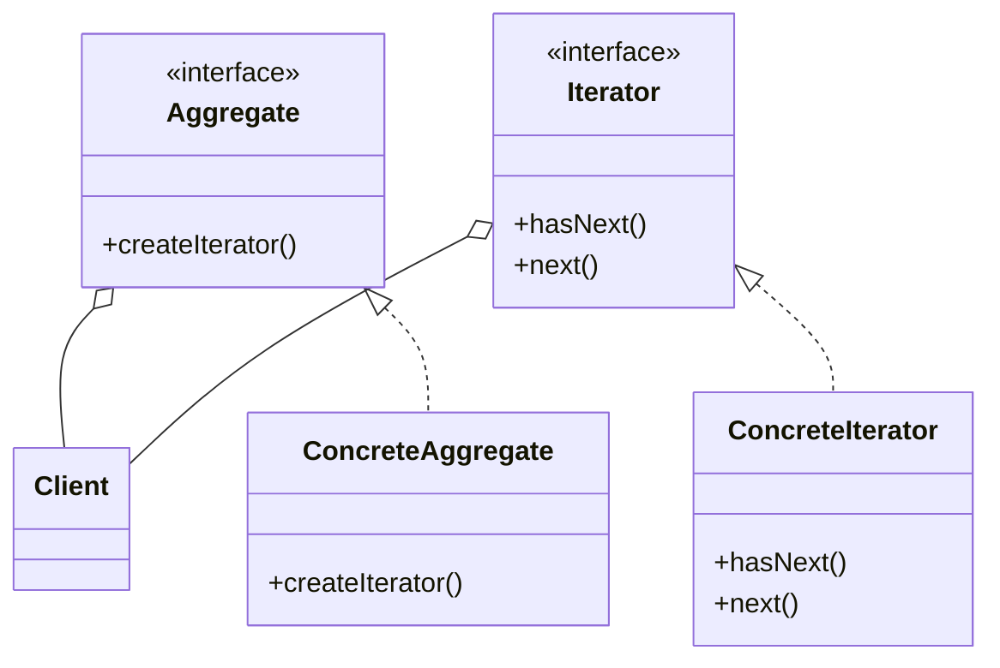

# Iterator Pattern

> Provides a way to access the elements of an aggregate object sequentially without exposing its underlying representation.

## Rationale

- Allows you to access items in a collection without needing to know its internal structure.
- If a list changes from an array to and list, the iterator remains unchanged.

## Example

Say for instance we have a restaurant that has multiple menus that maybe have different structures. The _menu / list is the **Aggregate**_, the _different menus are **Concrete Aggregates**_ which implement the menu interface, and each menu will also implement its own **Iterator**.

### Code

```java
// --- Iterator.java (Iterator) ---
public interface Iterator<T> {
  T next();
  boolean hasNext();
}

// --- DinnerMenuIterator.java (Concrete Iterator) ---
public class DinnerMenuIterator implements Iterator<MenuItem> {
  private MenuItem[] menuItems;
  private int position = 0;

  public DinnerMenuIterator(MenuItem[] items) {
    this.items = items;
  }

  public MenuItem next() {
    // ... increment position and return the next item
  }

  public boolean hasNext() {
    // ... check for another item
  }
}

// --- Menu.java (Aggregate)
public interface Menu {
  Iterator<MenuItem> createIterator();
}

// --- DinnerMenu.java (Concrete Aggregate) ---
public class DinnerMenu implements Menu {

  public Iterator<MenuItem> createIterator() {
    return new DinnerMenuIterator(menuItems);
  }
}

// --- Restaurant.java (Client)
public class Restaurant {
  private Menu dinnerMenu;

  public Restaurant(Menu dinnerMenu) {
    this.dinnerMenu = dinnerMenu;
  }

  public void printMenu(Iterator<MenuItem> iterator) {;
    while (iterator.hasNext()) {
      MenuItem menuItem = iterator.next();
      System.out.println(menuItem.getName() + ", " + menuItem.getPrice() + ": " + menuItem.getDescription());
    }
  }
}

```

### Class Diagram



## Using Built-in Iterators

In high level languages it is not common to implement your own iterator pattern as these are features built into the language. In Java, JavaScript, and Python there are built-in iterators. These languages also have enhanced for loop statements that implement the iterator pattern behind the scenes.

### Java

```java
for (Fruit fruit : fruits) {
    // ...
}
```

### JavaScript

```js
for (const fruit of fruits) {
    // ...
}
```

### Python

```python
for fruit in fruits:
    # ...
```
