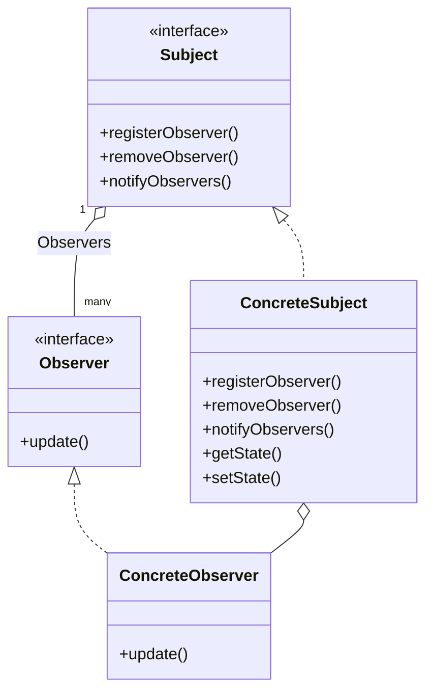

# Observer Pattern

> Defines a one-to-many dependency between objects so that when one object changes state, all its dependents are notified and updated automatically.

## Rationale

- strive for loosely coupled designs between objects that interact. That is objects that are only coupled due to interaction and don't know a lot about each other.
- great for keeping track of changes in a system's state. Allowing any class to implement the observer interface and effectively subscribe to notifications on the subjects state changes.

## Example

A good example of the Observer pattern is a news agency that sends out news updates to its subscribers. _The news agency is the **subject**_, and _the subscribers are the **observers**_. When the news agency has a new update, it notifies all its subscribers.

### Code

The **Subject** doesn't care about the objects that are in the observers list but it _notifies_ them when its state changes. **Observers** can _add_ and _remove_ themselves from this list at any time.

#### Subject

```java
// --- Subject.java ---
public interface Subject {
  public void registerObserver(Observer o);
  public void removeObserver(Observer o);
  public void notifyObservers();
}

// --- SimpleSubject.java ---
// this is the concrete subject implementation
public class SimpleSubject implements Subject {
  // manages the list of observers
  private ArrayList<Observer> observers;

  // manages the data the observers are interested in
  private int value = 0;

  public SimpleSubject() {
    observers = new ArrayList<Observer>();
  }

  public void registerObserver(Observer o) {
    // ... add observer to the list
  }

  public void removeObserver(Observer o) {
    // ... remove observer from the list
  }

  // when the data changes the observers are notified
  public void notifyObservers() {
    for (Observer observer : observers) {
      observer.update(value);
    }
  }
  public void setValue(int value) {
    this.value = value;
    notifyObservers();
  }
}
```

#### Observer

```java
// --- Observer.java ---
// all observers that want to participate / be notified when the
// data changes they must implement this interface.
public interface Observer {
  public void update(int value);
}

// --- SimpleObserver.java ---
// this is the concrete observer implementation
public class SimpleObserver implements Observer {
  private int value;
  private Subject simpleSubject;

  public SimpleObserver(Subject simpleSubject) {
    this.simpleSubject = simpleSubject;
    simpleSubject.registerObserver(this);
  }

  public void update(int value) {
    this.value = value;
    display();
  }

  public void display() {
    System.out.println("Value: " + value);
  }
}
```

### Class Diagram


