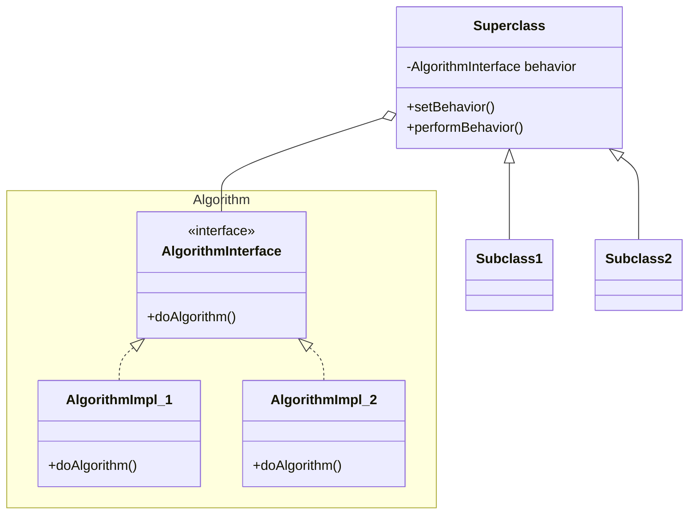

# Strategy Pattern

> Defines a family of algorithms, encapsulates each one, and makes them interchangeable.

## Design Principles

- **_Encapsulate What Varies_**: If some aspect of your code is changing, that's a sign that it should be separated.
- **_Program to an Interface_**: Design code to interact with an interface rather than a concrete implementation.
- **_Composition over Inheritance_**: Instead of inheriting behavior like the IS-A relationship, the HAS-A composes the behavior.

## Rationale

- Allows you to alter an objects behavior at runtime by associating it with different _concrete behaviours_.
- Instead of overriding methods on each sub-class you can instead choose what concrete behavior to use.
- Avoids being locked into compile time behavior.

## Example

A concrete instance refers to any occurrence of objects that exist during the runtime of a computer program. When you directly extend a class you inherit all its concrete behaviors but when you use the strategy pattern you can choose what concrete behavior to use.

### Code

For instance in the **Superclass** you might have a method like the one below to allow changes to what algorithm is being used.

```java
public void setAlgorithm(Sharing sharing) {
  this.sharing = sharing;
}
```

### Class Diagram

Inside the below class diagram both the _algorithms implement the **AlgorithmInterface**_ and the **Superclass** _has_ one of these algorithms. This can either be set via a method like above or from a constructor.


